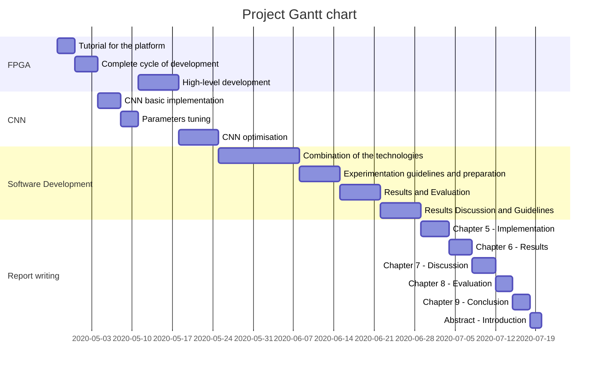

## Gantt chart 

> See https://mermaid-js.github.io/mermaid/#/gantt for further details about Gantt charts in Markdown.

```mermaid
gantt
  dateFormat DD-MM-YYYY
  title Project Gantt chart

  section FPGA
  Tutorial for the platform       : f1, 27-04-2020, 3d
  Complete cycle of development   : f2, after f1, 4d
  High-level development          : f3, 11-05-2020, 7d

  section CNN
  CNN basic implementation        : c1, after f2, 4d
  Parameters tuning               : c2, after c1, 3d
  CNN optimisation                : c3, after f3, 7d

  section Software Development
  Combination of the technologies            : s1, after c3, 14d
  Experimentation guidelines and preparation : s2, after s1, 7d
  Results and Evaluation                     : s3, after s2, 7d
  Results Discussion and Guidelines          : s4, after s3, 7d

  section Report writing
  Chapter 5 - Implementation								 : w1, after s4, 5d
  Chapter 6 - Results												 : w2, after w1, 4d
  Chapter 7 - Discussion										 : w3, after w2, 4d
  Chapter 8 - Evaluation 										 : w4, after w3, 3d
  Chapter 9 - Conclusion										 : w5, after w4, 3d
  Abstract - Introduction                    : after w5, 2d
```

